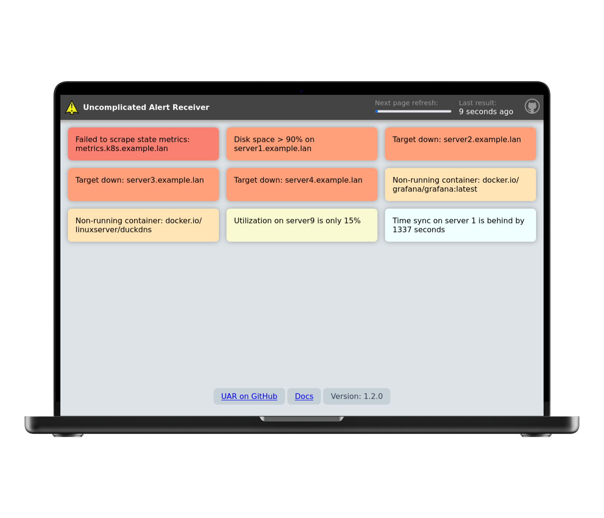

  
  <h1>uncomplicated-alert-receiver (UAR)</h1>

Show Prometheus Alertmanager alerts on heads up displays.

UAR is documented on the [UAR Documentation Site](https://jamesread.github.io/uncomplicated-alert-receiver/)

## Screenshots

A robust and reliable Prometheus alert receiver intended for heads up displays. It works without internet access, has no external dependencies, no configuration files, no storage needs, and generally has very few things to go wrong - all it does it receives alerts, and displays them in a simple webpage.

It is designed to supplement other alert receivers, which typically are used for sending notifications, such as email, slack, pagerduty, etc. It is not a replacement for those services, but a supplement to them.

## Why, what problem does this solve?

For years, I tried to create better and better Grafana dashboards on my heads up displays, cycling dashboards, showing pretty pictures and graphs. I agonized over making dashboards that displayed the right information at the right time, but something was missing. The problem was the noise, I was being shown all this information constantly as pretty graphs and visualizations, but Grafana has no idea if something is actually wrong - it's fundamentally just a pretty way to display data. What I was missing, was alerts from Prometheus when something was wrong, and then I would use Grafana to explore the information and try to figure out why. Now I have alerts on my heads up displays, and Grafana's role is on my desktop browser to explore the data, not on my heads up displays.

Additionally, this project is designed to be extremely robust, and reliable, and simple. It does one job (hopefully well). For day to day usage, or just referred to in emergencies, it should "just work".

## Installation & Setup

UAR is documented on the [UAR Documentation Site](https://jamesread.github.io/uncomplicated-alert-receiver/). You'll find everything there to install UAR, setup Alertmanager, and understand how to use UAR.

## This is a No-Nonsense Open Source project

- All code and assets are Open Source (AGPL).
- No company is paying for development, there is no paid-for support from the developers.
- No separate core and premium version, no plus/pro version or paid-for extra features.
- No SaaS service or "special cloud version".
- No "anonymous data collection", usage tracking, user tracking, telemetry or email address collection.
- No requests for reviews in any "app store" or feedback surveys.
- No prompts to "upgrade to the latest version".
- No internet-connection required for any functionality.
