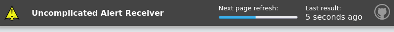

# User Guide

When you have UAR installed, you will see a header that looks like this. The header has a couple of components;

## UI Introduction

- **Next Page Refresh** (Progress Bar): By default, UAR will refresh every 30 seconds. The process bar will show the time until the next refresh. It's useful to see this on heads up displays, as they can lock up, or get screen-freeze, and this progress bar proves the page has not frozen.

- **Last result**: This shows the number of seconds (or minutes, hours, days) since the last payload was received. This is useful to see if the payload is being received at all, or if your Alertmanager may be having issues. This will also show issues if there were errors talking to the UAR API.

## Severity levels

UAR will render alerts according to their severity label, when available. The following severity levels are hard-coded, and ordered from highest to lowest;

- **Critical**: 1
- **Severe**: 2
- **Warning**: 3
- **Important**: 4
- **Info**: 5
